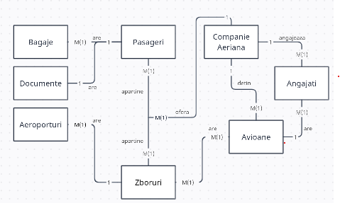
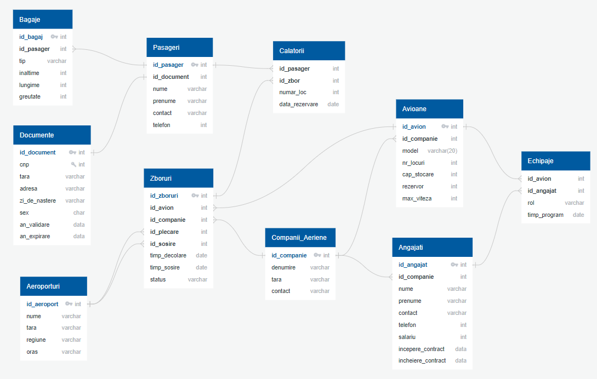

# Air Transport Database Project

This project models the core elements of an air transport system using a relational database. It was developed for academic purposes and showcases complex database concepts such as relationships, procedures, functions, triggers, cursors, collections, and packages using PL/SQL.

## Project Overview

The system captures the interactions between passengers, flights, airlines, aircraft, and supporting entities such as documents, baggage, employees, and airports.

### Main Tables

    

- **Passengers** – people who travel using the airline services. *(PK: id_pasager, FK: id_document)*
- **Documents** – identity validation documents for passengers. *(PK: id_document)*
- **Luggage** – baggage that passengers carry. *(PK: id_bagaj, FK: id_pasager)*
- **Airports** – takeoff and landing locations. *(PK: id_aeroport)*
- **Airplanes** – aircraft used for transportation. *(PK: id_avion, FK: id_companie)*
- **Flights** – movements of airplanes between airports. *(PK: id_zbor)*
- **Airline Companies** – companies managing flights. *(PK: id_companie)*
- **Employees** – staff employed by airlines. *(PK: id_angajat, FK: id_companie)*

### Associative Tables

- **Journeys** – links passengers to flights with seat number and reservation date. *(FKs: id_pasager, id_zbor)*
- **Flight Crews** – links employees to airplanes with their role and worked hours. *(FKs: id_avion, id_angajat)*

### Relationships

    

- **1:1** – Passengers ↔ Documents, Flights ↔ Airplanes, Flights ↔ Airline
- **1:N** – Passengers → Luggage, Airlines → Employees, Airlines → Airplanes, Airports → Flights (twice for departure/arrival)
- **N:N** – Airplanes ↔ Employees, Passengers ↔ Flights (via Journeys)

---

## Technical Features

This project includes advanced PL/SQL constructs implemented through stored procedures, functions, triggers, and packages.

### Implemented Tasks

1. **Stored Procedure using All 3 Collection Types**  
   - A complex task modeled in natural language and implemented using nested tables, VARRAYs, and associative arrays.

2. **Stored Procedure Using Two Cursors**  
   - Includes a parameterized cursor dependent on another cursor.

3. **Stored Function using 3 Tables + Custom Exceptions**  
   - A robust function combining multiple tables with exception handling to cover edge cases.

4. **Stored Procedure using 5 Tables + Exception Handling**  
   - Includes complete exception handling for `NO_DATA_FOUND`, `TOO_MANY_ROWS`, and more.

5. **LMD Trigger (Statement-Level)**  
    - Trigger executed at the statement level for data manipulation operations.

6. **LMD Trigger (Row-Level)**  
    - Trigger executed per row, often used for auditing or conditional logic.

7. **DDL Trigger**  
    - A trigger fired on structural changes to the database (e.g., `CREATE`, `ALTER`).

8. **Package Definition**  
    - A modular package that includes all defined subprograms and shared types.

9. **Complex Data**
    - Define a package that includes complex data types and objects required for an integrated flow of actions specific to the defined database (at least 2 data types, at least 2 functions, and at least 2 procedures).

## Technologies

- **Database:** Oracle
- **Language:** SQL, PL/SQL
- **Tools:** SQL Developer, dbdiagram.io, diagrams.net
